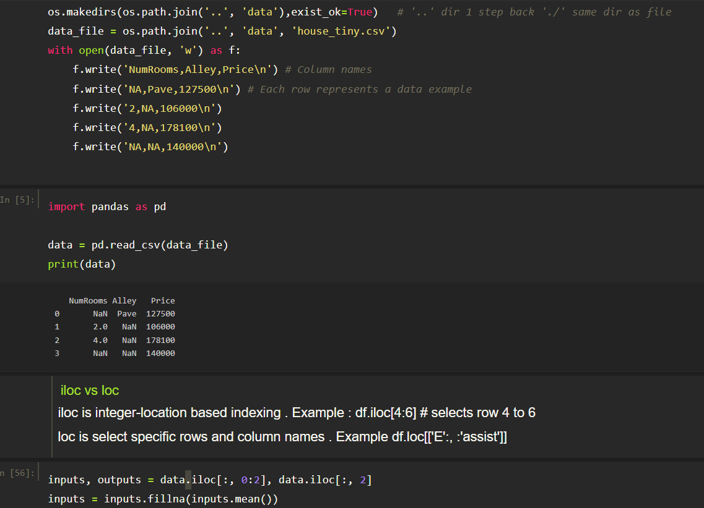
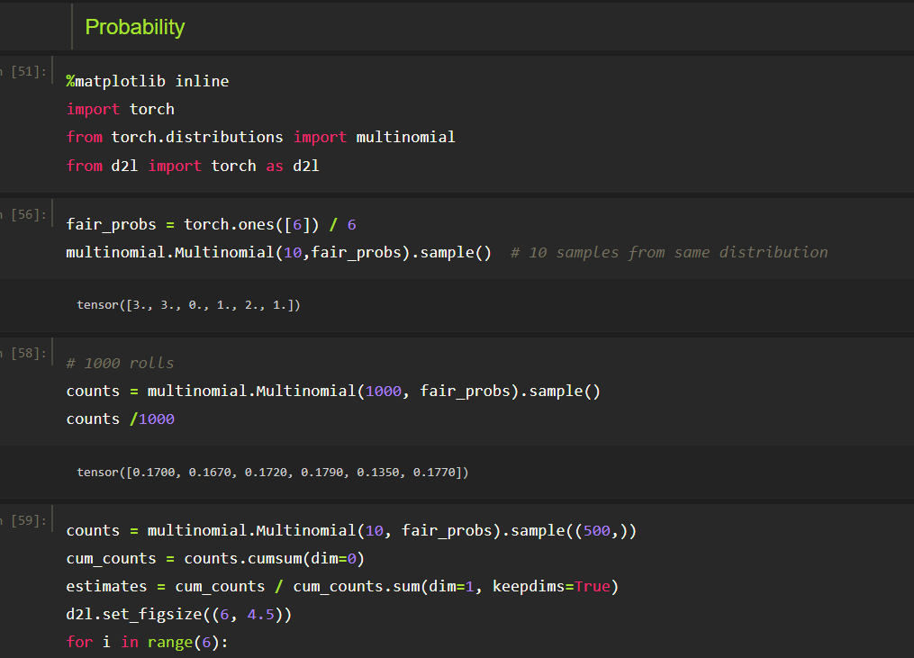

# #66DaysOfData

Day 1 of #66DaysOfData
  * Today I learned and refreshed my knowledge about basics of data manipulation using pandas, pytorch and linear algebra.
  

Day 2-3 of #66DaysofData
 * Today I learned about calculus and probabilities topics like RV, Joint Probability, Conditional Probability and Bayes Theorem. I also learned about Pytorch cool auto grad function. 
 
